# Taller-2-Backend
## Integrantes:
- Wilmer Santiago
- Bryan Montoya
- Luis Robles
# Descripción de la solución

Este proyecto implementa una API REST de productos con Node.js y Express. La API mantiene un catálogo de tres productos en memoria y ofrece endpoints para consultar la información general del servicio, verificar su estado y obtener productos.

La solución se ejecuta mediante Docker Compose y está compuesta por una API, un proxy inverso Nginx y un contenedor Redis (extra). Nginx recibe las solicitudes desde el host en el puerto `8080` y las reenvía a la API a través de la red interna de Docker. Redis se incluye como servicio adicional para demostrar la resolución de nombres entre contenedores, pero no es utilizado por el código de la API.

Endpoints disponibles en la API:

- `GET /`: información de la API y listado de endpoints.
- `GET /health`: comprobación del estado del servicio.
- `GET /api/products`: listado de productos.
- `GET /api/products/:id`: consulta de un producto por identificador; devuelve `404` si no existe.

# Arquitectura implementada

La arquitectura utiliza tres servicios conectados a la red Docker privada `netw`:

- `api`: se construye con `dockerfile` a partir de `node:20-alpine`. Ejecuta `src/server.js` en el puerto `3000`. Este puerto se declara mediante `expose`, por lo que solo es accesible desde otros contenedores de la red y no directamente desde el host.
- `nginx`: utiliza la imagen `nginx:latest`, monta `nginx/nginx.conf` y publica el puerto `8080` del contenedor en el puerto `8080` del host. Sus rutas `/health` y `/api/products` utilizan `proxy_pass` hacia `http://api:3000`.
- `redis`: utiliza `redis:alpine` y se conecta a `netw`. No publica puertos ni tiene integración implementada en `src/server.js`.

# Instrucciones para ejecutar el proyecto

## Requisitos

- Docker Engine o Docker Desktop con Docker Compose disponible.
- Node.js 20 o superior únicamente si se desea ejecutar la API fuera de Docker.

## Ejecución con Docker Compose

Desde la raíz del proyecto, ejecutar:

```bash
docker compose up --build -d
```

El comando construye la imagen de `api` y levanta los servicios `api`, `nginx` y `redis` en segundo plano. Para comprobar que están activos:

```bash
docker compose ps
```

Probar la API a través de Nginx:

```bash
curl http://localhost:8080/health
curl http://localhost:8080/api/products
```

La aplicación queda disponible en `http://localhost:8080`. La ruta raíz (`/`) no está configurada como ruta del proxy en Nginx, por lo que no debe utilizarse como comprobación de un endpoint publicado.

Para detener y eliminar los contenedores creados por Compose:

```bash
docker compose down
```

## Ejecución local de la API

Si se ejecuta sin Docker, instalar las dependencias y arrancar directamente el archivo del servidor:

```bash
npm install
node src/server.js
```

# Comandos Docker utilizados

Construir la imagen y levantar todos los servicios:

```bash
docker compose up --build -d
```

Consultar el estado de los servicios:

```bash
docker compose ps
```

Consultar los logs de todos los servicios o de un servicio específico:

```bash
docker compose logs
docker compose logs nginx
docker compose logs api
```

Ejecutar un comando dentro de un contenedor para comprobar la resolución DNS de Redis desde la API:

```bash
docker compose exec api getent hosts redis
```

Listar las redes Docker e inspeccionar la red del proyecto:

```bash
docker network ls
docker network inspect taller-2-backend_netw
```

El nombre final de la red puede variar si se cambia el nombre del proyecto Compose. Para identificarlo, utilizar primero `docker network ls`.

Detener y eliminar los contenedores y la red creada por Compose:

```bash
docker compose down
```
# Preguntas en el desarrollo
## ¿Cuál es la diferencia entre el puerto del contenedor y el puerto publicado en el host?
El puerto del contenedor es donde escucha la aplicación dentro de la red Docker, en este caso `3000`. El puerto publicado enlaza un puerto del host con el contenedor y permite el acceso externo; Nginx publica el puerto `8080`.
## ¿Por qué http://api:3000 funciona entre contenedores, mientras que http://localhost:3000 no representa correctamente al contenedor api?
`api` es el nombre DNS del servicio dentro de la red Docker y apunta al contenedor de la API. `localhost` apunta al mismo contenedor desde el que se realiza la solicitud, en este caso Nginx, no al contenedor `api`.
## Explique la diferencia entre `ports` y `expose` en Docker Compose
`ports` publica y mapea un puerto del contenedor hacia el host, como `8080:8080` en Nginx. `expose` declara un puerto para la comunicación entre servicios de la red Docker, sin publicarlo en el host; la API utiliza `expose` para el puerto `3000`.
## Diagnóstico de errores
### ¿Qué error obtiene?
Error 502 Bad Gateway
### ¿Por qué ocurre?
Ocurre porque Nginx recibe la petición pero al intentar resolver `localhost` se devuelve en el `proxy_pass`: `127.0.0.1` que es el propio contenedor. Al no tener nada escuchando en el contenedor en el puerto 3000 el sistema operativo rechaza la solicitud y Nginx al no poder comunicarse con el upstream devuelve al cliente error 502
### ¿Por qué localhost no representa al contenedor api?
Porque cada contenedor tiene su propio entorno de red aislado y al utilizar `localhost` estos siempre harán referencia a sí mismos. Para utilizar o llamar a otro contenedor, se debe comunicar utilizando el nombre de este otro contenedor para la conexión dentro de la red privada donde estarán todos los contenedores debido a la creación de un DNS privado que crea Docker con todos los contenedores en él.
### ¿Cómo solucionaría el problema?
Hacer referencia a otros contenedores con sus nombres (en nuestro caso `api`) anexando el puerto donde se encuentra el servicio que queremos consumir
### ¿Qué comando utilizaría para verificar las redes Docker?
Con el comando `docker network ls` se listarán todas las redes que tenga en el sistema
Y con el comando `docker network inspect <red>` se ve el detalle de una red en concreto con su nombre de red, viendo sus contenedores conectados y sus IPs dentro de la red
# Evidencias
## Parte 2:
- Construir la imagen:
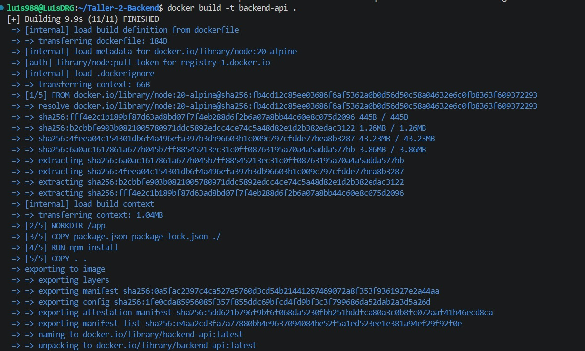
- Correr el contenedor
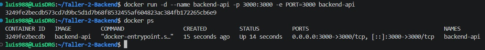
## Parte 8:
- Comprobar que el puerto 8080 sin añadir un endpoint especial no retorna información
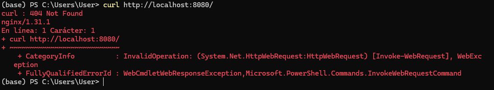
- Comprobar la salud de la API
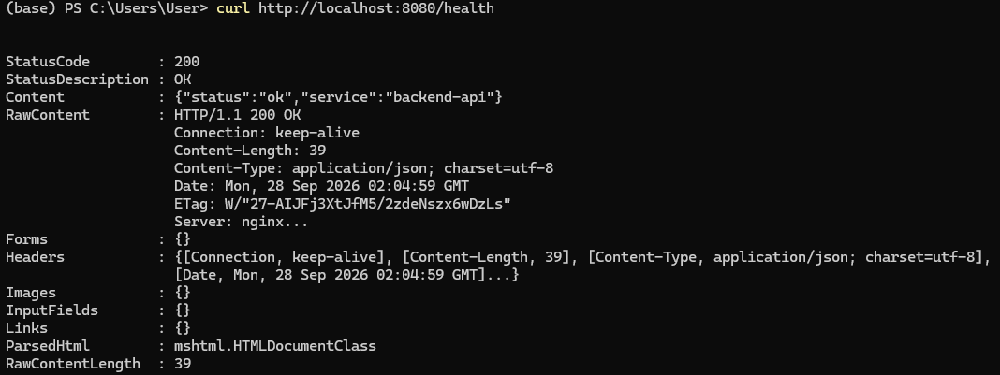
- Comprobar la respuesta de la API ante la solicitud de productos
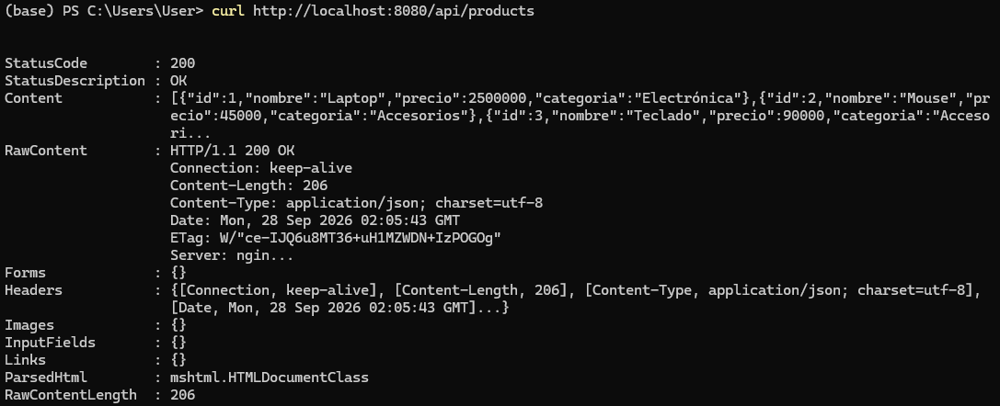
- Listar todos los contenedores levantados por el docker compose
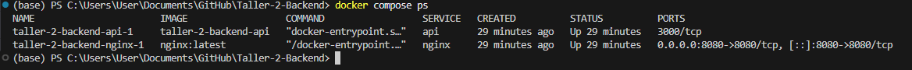
- Ver los logs del servidor nginx levantandose
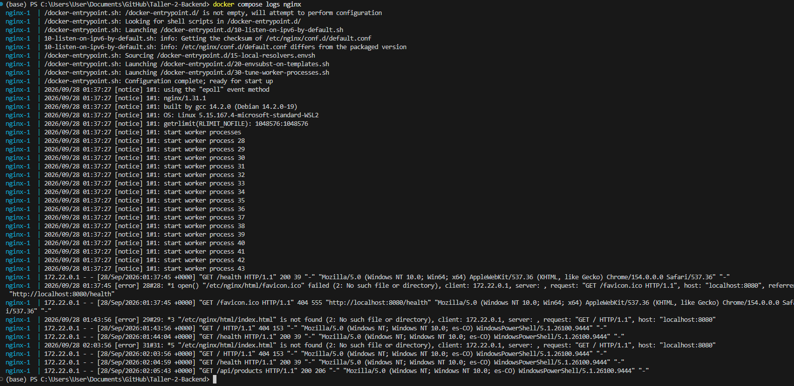
- Ver los logs de la API levantandose
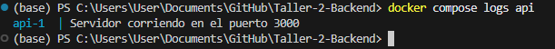
## Parte 9:
- Se realiza la modificación temporal en la configuración de Nginx para realizar la prueba
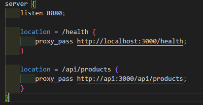
- Se presenta el error de Bad Gateway
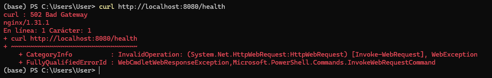
- Se inspecciona la red del taller
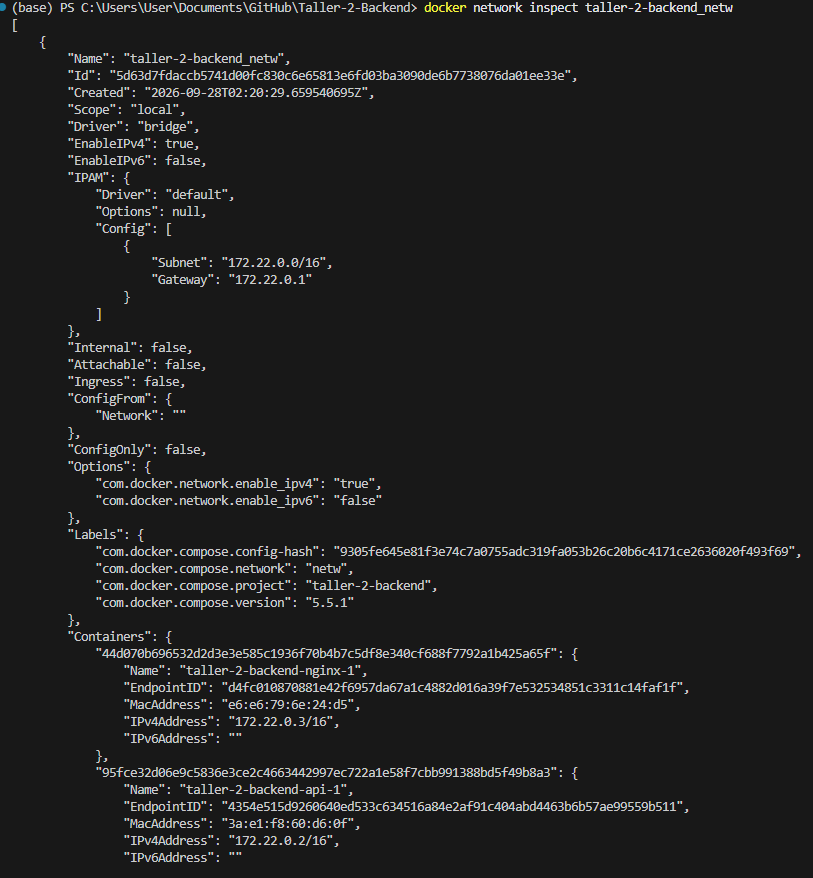
## Parte 10 (Extra)
- IPs de los 3 contenedores donde ya se incluye Redis
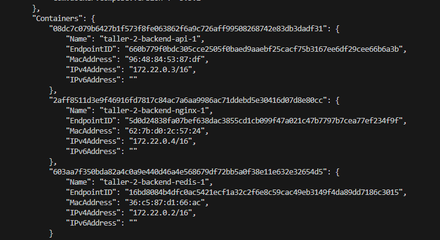
- Se ejecuta `docker compose exec api getent hosts redis` para comprobar, desde el contenedor `api`, a qué IP resuelve el nombre `redis`. El comando devuelve la IP del contenedor de Redis dentro de la red `netw`, lo que demuestra que el DNS interno de Docker Compose resuelve los servicios por su nombre y que `api` puede localizar a `redis` sin usar `localhost` ni direcciones IP fijas.
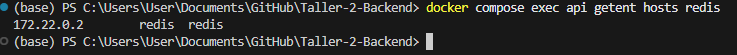
